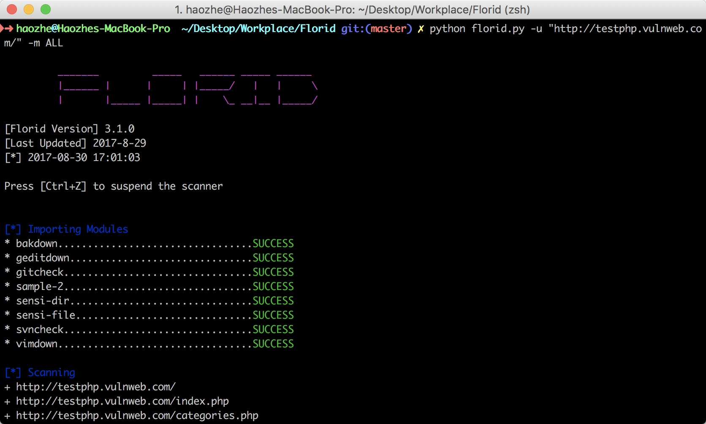

# Florid Scanner
An active scanner specially for CTF Game

### Usage:

```
python florid.py -h
python florid.py -u "http://testphp.vulnweb.com/product.php?pic=1" -m "gitcheck, vimdown"
python florid.py -u "http://testphp.vulnweb.com/product.php?pic=1" -m ALL
```



### Note

Modules to run before the check starts should be placed in `./module/phase_one`

Modules for checking URLs should be placed in `./module/phase_two/`

You are expected to develop your modules referring to `./module/phase_two/sample-2.py`

### Update Log

#### v 3.1.1

* New interface
* Screenshot update
* Readme file update
* Bugs fix
